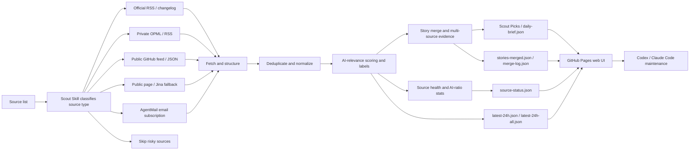

<div align="center">

# AI News Radar

## 24h AI Updates Radar｜Scout Skill

**Scout Skill helps you find the thoroughbreds among a pile of sources, then turns scattered updates into a traceable AI story timeline.**

[](https://github.com/LearnPrompt/ai-news-radar/stargazers)
[](https://learnprompt.github.io/ai-news-radar/)
[](https://github.com/LearnPrompt/ai-news-radar/actions/workflows/update-news.yml)
[](skills/radar/README.md)
[](LICENSE)

[Live site](https://learnprompt.github.io/ai-news-radar/) · [中文](README.md) · [Radar Skill](skills/radar/README.md) · [Scout Skill](skills/ai-news-radar/README.md) · [Source strategy](docs/SOURCE_COVERAGE.md)

</div>

---

## Pick your lane in 30 seconds

**① Just want the daily AI brief** → no install needed, open the [live site](https://learnprompt.github.io/ai-news-radar/).

**② Want your agent to read it for you** → install the Radar Skill (ai-radar). Zero API, zero key, zero server:

```bash
npx skills add LearnPrompt/ai-news-radar -s ai-radar -g
```

Then just ask your agent: `What happened in AI today?`


**③ Want a radar that is fully yours** → fork this repo and let the in-repo [Scout Skill](skills/ai-news-radar/README.md) classify your sources and deploy GitHub Pages. Your sources, your data.

The three lanes are one road: read the brief → let your agent read it → run your own radar.

---

## What is this?

AI News Radar is an auto-updating 24h radar for AI updates. It does more than fetch AI news. It judges source quality first, merges the same event into a story timeline, then uses Scout picks, AI labels, source health, and AI ratio to help you decide:

what is worth reading, what deserves deeper research, and what is just noise.

Readers can open the page and scan the last 24 hours of AI, model, and developer-tool updates. Developers can fork this repo and connect their own OPML/RSS, public feeds, static pages, or AgentMail inboxes. Codex / Claude Code-style agents can use the in-repo **Scout Skill** to judge new sources, maintain fetch logic, and deploy to GitHub Pages.

This project will never be “one more news page”.

Its core logic is **Scout Skill**. It helps you find the thoroughbreds among a pile of sources. Which sources are worth tracking long term? Which ones should become RSS/OPML inputs? Which ones only make sense through a paid API? Which sources update all day, but have less than 5% AI signal for what you actually care about?

Judge first. Then connect.

<table>
  <tr>
    <td></td>
    <td></td>
  </tr>
  <tr>
    <td></td>
    <td></td>
  </tr>
</table>

## Why Scout Skill?

Good updates are scattered everywhere.

Official blogs publish one thing. Changelogs publish another. Someone drops an early signal on X. Aggregator sites keep reposting the same story.

I thought I was tracking the frontier. Most days, I was repeating the same three chores:

open dozens of pages, filter duplicates by hand, and guess which link was worth reading.

Let Scout Skill handle the first pass: **which sources are thoroughbreds, and which ones are noise**.

You can keep adding sources freely. You can also put a source into the input set, let it run for a week, and decide later whether it deserves to be promoted.

AI News Radar was never just about fetching information.

It is closer to a lightweight news pipeline: source judgement, fetching, deduplication, AI-relevance filtering, source health, and static web publishing. Once deployed, the core flow does not spend model tokens.

## What it can do

### For readers

- Open the live site and scan the last 24 hours of AI, model, Agent, developer-tool, and tech-ecosystem updates
- Use “Scout Picks” to see high-value story timelines first, instead of manually filtering hundreds of items
- Continue reading the full AI-focused feed in “AI Signal Flow”
- Locate updates quickly with site, keyword, time, and source filters
- See each item’s AI label, AI-relevance score, source platform, and publish time
- Use source health and AI ratio to tell which sources are actually useful, and which ones update a lot but contain little AI signal

### For content creators

- Preserve original source links for deeper research, fact checking, and topic planning
- Merge multiple sources for the same event, reducing duplicate reading
- Use AI labels to judge whether an item is better for a post, short video, or hands-on tool test
- Use signals such as multi-source overlap, official-first source, and single-source watch item to judge topic credibility and priority

### For developers and agents

- Requires no API key, login state, or LLM quota by default
- Supports official RSS/changelog sources, OPML/RSS, public GitHub feed/JSON files, static pages, and AgentMail
- GitHub Actions automatically generates `data/*.json` and publishes to GitHub Pages
- Codex / Claude Code / Hermes / OpenClaw can use the in-repo Scout Skill to maintain sources, fetch logic, and the web page
- Advanced sources can be connected through GitHub Secrets or local environment variables, without committing tokens, cookies, private OPML files, or email bodies

## v0.7: from timeline to hot radar

v0.6 merged scattered messages into story lines. v0.7 answers the next question:

**with this many stories, what is hot right now?**

v0.7 ships four things:

- **Hot view**: Scout Picks gains a hot mode that ranks story clusters by multi-source mass × time decay — something is only "hot" when several independent sources are saying it. The view hides itself when there is no real multi-source heat.
- **Quality over quantity**: a brief slot must be earned by multi-source confirmation or a strong score. On quiet days the picks block disappears entirely — no empty shell, the page falls back to the pure timeline.
- **Scoring backtest tool**: `scripts/backtest_scoring.py` replays any two versions of the scoring logic against the archive. House rule: scoring changes ship with a ≥14-day replay report.
- **ai-radar consumer skill**: install it and ask your agent "What happened in AI today?" — it reads this site's public JSON directly. Zero API, zero key, and the whole data pipeline is forkable.

Story merging, AI labels/scores, and source health from v0.6 remain the foundation. See [Releases](https://github.com/LearnPrompt/ai-news-radar/releases) for the full history.

## How it works



AI News Radar borrows from modern newsroom workflows. Dumping thousands of items into a page is not useful, so the project turns news handling into a stable pipeline: fetch, deduplicate, filter, enrich with status, and generate a static site.

It stays lightweight on purpose. The public version does not require an LLM API key, login state, cookies, X API access, or email access. When you need advanced sources, Scout Skill can connect them through GitHub Secrets or local environment variables.

## Data outputs

Each update generates a set of static JSON files. The page only reads these files and does not need a backend service.

Core files include:

- `data/latest-24h.json`: AI-focused updates from the last 24 hours
- `data/latest-24h-all.json`: all updates from the last 24 hours
- `data/source-status.json`: source fetch status, success rate, site coverage, and source health
- `data/daily-brief.json`: Scout Picks story timeline for the homepage
- `data/stories-merged.json`: the complete merged story set
- `data/merge-log.json`: story-merge matches and debug records for auditing

If `daily-brief.json` is not available yet, the page falls back to candidate Scout signals; if it exists but no story passed the quality gate that day, the picks block hides entirely and the page shows the pure timeline.

## Quick start

Readers do not need to install anything. Open the live site directly.

To fork and customize your own version locally:

```bash
git clone https://github.com/LearnPrompt/ai-news-radar.git
cd ai-news-radar
python3 -m venv .venv
source .venv/bin/activate
pip install -r requirements.txt
python scripts/update_news.py --output-dir data --window-hours 24
python -m http.server 8080
```

Open:

```text
http://localhost:8080
```

If you have your own OPML:

```bash
cp feeds/follow.example.opml feeds/follow.opml
# Put your own subscriptions into feeds/follow.opml. Do not commit this file.
python scripts/update_news.py --output-dir data --window-hours 24 --rss-opml feeds/follow.opml
```

## Tutorial for agents

If you want Codex / Claude Code / OpenClaw / Hermes to help you build your own version, say:

```text
Use Scout Skill for AI News Radar. Ask me for my source list first, then decide whether each source should use RSS, public feeds, static pages, Jina fallback, AgentMail email, or be skipped. The goal is to deploy a serverless AI daily news site that updates automatically with GitHub Actions. Do not commit any API keys, cookies, tokens, or private email content into the repo.
```

The repo ships two skills — the radar reads, the scout selects:

- `skills/radar/`: **ai-radar** (consumer side) — install without forking, ask AI news questions in natural language, get a brief from this site's public JSON
- `skills/ai-news-radar/`: **Scout Skill** (maintainer side) — after forking, use it to classify sources, maintain fetch logic, and deploy GitHub Pages

When a new agent takes over validation, read these first:

- `README.md`
- `README.en.md`
- `docs/GPT_HANDOFF.md`
- `docs/SOURCE_COVERAGE.md`
- `docs/V2_PRODUCT_BRIEF.md`

## GitHub Actions updates

`.github/workflows/update-news.yml` is already configured.

- Runs every 30 minutes by default
- Automatically generates and commits `data/*.json`
- Uses public demo `feeds/follow.example.opml` when `FOLLOW_OPML_B64` is not configured, so the hosted page can show the RSS/OPML path working
- Decodes `FOLLOW_OPML_B64` into private `feeds/follow.opml` when configured
- Generates a redacted email summary when `EMAIL_DIGEST_ENABLED=1`, `AGENTMAIL_API_KEY`, and `AGENTMAIL_INBOX_ID` are set
- Commits `data/email-digest.json` only when `EMAIL_DIGEST_PUBLISH=1` is also explicitly set
- Uses the official X API during the configured daily UTC window when `X_API_ENABLED=1`, `X_BEARER_TOKEN`, and budget variables are set. This is off by default, and the current X API charges by returned resources.

By default, the core pipeline requires no API keys.

Advanced source templates live in `examples/advanced-sources.env.example`.

Budget notes are in `docs/research/advanced-source-free-tier-budget-2026-05-10.md`.

The X API demo config is in `docs/guides/x-api-demo-config.md`.

The single-account / single-newsletter demo is in `docs/guides/rileybrown-alphasignal-demo.md`.

## License

[MIT](LICENSE)
