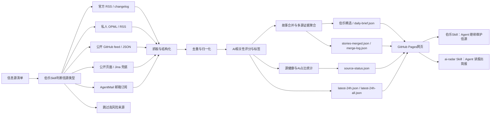

<div align="center">

# AI News Radar

## 24小时AI更新雷达｜伯乐Skill

**伯乐Skill（Scout Skill）帮你从一堆信源里选出千里马，并把分散消息合并成可追踪的AI故事线。**

[](https://github.com/LearnPrompt/ai-news-radar/stargazers)
[](https://learnprompt.github.io/ai-news-radar/)
[](https://github.com/LearnPrompt/ai-news-radar/actions/workflows/update-news.yml)
[](skills/radar/README.md)
[](LICENSE)

[在线页面](https://learnprompt.github.io/ai-news-radar/) · [English](README.en.md) · [雷达Skill](skills/radar/README.md) · [伯乐Skill](skills/ai-news-radar/README.md) · [信息源策略](docs/SOURCE_COVERAGE.md)

</div>

---

## 30秒选边上车

**① 只想看AI日报** → 不用装任何东西，直接打开[在线页面](https://learnprompt.github.io/ai-news-radar/)。

**② 想让Agent替你读** → 装雷达Skill（ai-radar），零API、零Key、零服务器：

```bash
npx skills add LearnPrompt/ai-news-radar -s ai-radar -g
```

装完对Agent说一句：`今天AI圈有什么？`


**③ 想要一个完全属于自己的雷达** → fork本仓库，让内置的[伯乐Skill](skills/ai-news-radar/README.md)帮你录入信源、部署GitHub Pages。信源你选，数据归你。

三层是一条路：看报 → 让Agent读报 → 自己办报。

---

## 这是什么

AI News Radar是一个自动更新的24小时AI更新雷达。它不只是把AI新闻抓回来，会先判断信息源质量，把同一个事件合并成故事线，最后用伯乐Skill精选、AI标签、源健康和AI占比帮你判断，

什么信息值得看，什么值得深挖，什么只是噪音。

普通用户直接打开网页，看最近24小时AI、模型、开发者工具和技术生态更新。开发者可以fork这个仓库，接入自己的OPML/RSS、公开feed、静态页面或AgentMail邮箱。Codex / Claude Code这类 Agent 可以使用项目内置的 **伯乐Skill**，继续帮你判断新的信息源、维护抓取逻辑、部署 GitHub Pages。

这个项目永远都不会是“又一个新闻网页”。

它的核心逻辑是**伯乐Skill**，帮你从一堆信源里选出千里马。哪些源值得长期追踪，哪些源适合做成RSS/OPML，哪些源只能接付费的API，哪些源看起来更新很多但实际上跟你长期关注的方面比方AI只占了里面的5%不到。

先判断清楚，再接入。

<table>
  <tr>
    <td></td>
    <td></td>
  </tr>
  <tr>
    <td></td>
    <td></td>
  </tr>
</table>

## 为什么需要伯乐Skill

好新闻分散在各处，

官方博客发一点，更新日志发一点，X上有人提前爆料，聚合站又把同一个新闻转来转去。

我以为的自己在追前沿，实际每天都在重复三件事，

打开几十个页面，肉眼+人脑过滤重复内容，猜哪条值得看。

让伯乐Skill先替你完成第一轮判断，**哪些信源是千里马，哪些是噪音**。

你可以随意增加信息源，还可以把一个信息源纳入输入范围，先让它在单独运行一周，再判断要不要录入。

AI News Radar从来都不是单纯把信息抓回来，

它更像是一条轻量的新闻pipeline，把来源判断、抓取、去重、AI强相关过滤、信息源健康状态和静态网页发布串起来，上线后不消耗模型额度。

## 能做什么

### 给普通读者

- 打开在线页面，直接看最近24小时AI、模型、Agent、开发者工具和技术生态更新
- 通过“伯乐精选”先看高价值故事线，再不用从几百条消息里肉眼筛选
- 在“AI信号流”里继续查看完整AI强相关消息
- 用站点、关键词、时间和来源筛选快速定位信息
- 看到每条消息的AI标签、AI相关性分数、来源平台和发布时间
- 通过源健康和AI占比判断：哪些源是真有料，哪些源更新很多但AI含量低

### 给内容创作者

- 保留原始来源链接，方便继续深挖、核对事实和做选题
- 把同一个事件的多个来源聚合到一起，减少重复阅读
- 用AI标签快速判断一条消息适合做图文、短视频、还是工具实测
- 用多源重合、官方一手、单源观察等信号判断选题可信度和优先级

### 给开发者和Agent

- 默认不需要 API Key、不需要登录态、不需要 LLM额度
- 支持官方 RSS/changelog、OPML/RSS、公开 GitHub feed/JSON、静态页面、AgentMail 等来源类型
- GitHub Actions自动生成 `data/*.json` 并发布到 GitHub Pages
- Codex / Claude Code / Hermes / OpenClaw 可以通过项目内置的伯乐Skill继续维护信源、抓取逻辑和页面
- 高级来源可以通过 GitHub Secrets或本地环境变量接入，避免把 token、cookies、私有 OPML 和邮箱正文写进仓库

## v0.7：从时间线到热点雷达

v0.6 把分散的消息合并成了故事线。v0.7 回答的是下一个问题：

**故事多了之后，怎么知道现在什么最热？**

v0.7 做了四件事：

- **当前热点视图**：伯乐精选新增热点模式，按多源聚簇 × 时间衰减排序——几个独立信源同时在说的事，才配叫热点。没有足够多源热点时，这个视图自动隐藏。
- **宁缺毋滥门槛**：精选席位必须靠多源确认或高分挣来，安静的日子精选区直接消失，不留空壳，页面回到纯时间轴。
- **评分回测工具**：`scripts/backtest_scoring.py` 把任意两个版本的评分逻辑在历史档案上重放对比。立下规矩：动评分必须附带 ≥14 天回测报告。
- **ai-radar 消费Skill**：装上后对Agent说"今天AI圈有什么"，它直接读本站公开JSON出中文简报——零API、零Key，数据管道可fork。

v0.6 引入的故事线合并、AI标签分数、源健康与AI占比，仍是这一切的地基。历次改动见 [Releases](https://github.com/LearnPrompt/ai-news-radar/releases)。

## 工作原理



AI News Radar学习了现代新闻学的技术，不是简单堆信息源，一次性放几万条信息出来等于没用，所以我选择把新闻处理拆成稳定pipeline，抓取，去重，过滤，补充状态，生成静态站点。

在保证稳定性的同时追求轻量化，公开版不要求用户配置LLM API Key，不依赖登录态，cookies，X API和邮箱。需要这些进阶能力时，可以通过伯乐Skill用GitHub Secrets或本地环境变量接入。

## 数据产物

每次更新会生成一组静态JSON文件，页面只读取这些文件，不需要后端服务。

核心文件包括：

- `data/latest-24h.json`：最近24小时AI强相关消息
- `data/latest-24h-all.json`：最近24小时全量消息
- `data/source-status.json`：来源抓取状态、成功率、站点覆盖和源健康
- `data/daily-brief.json`：伯乐精选故事线，供首页高价值时间线使用
- `data/stories-merged.json`：故事合并后的完整事件集合
- `data/merge-log.json`：故事合并过程和命中记录，方便调试与审计

如果 `daily-brief.json` 暂时不存在，页面会回退到候选信号列表；如果它存在但当天没有够格的故事（宁缺毋滥门槛），精选区会整体隐藏，页面回到纯时间轴。

## 快速开始

普通用户不用安装，直接打开在线页面即可。

想fork改造新版本，可以本地运行：

```bash
git clone https://github.com/LearnPrompt/ai-news-radar.git
cd ai-news-radar
python3 -m venv .venv
source .venv/bin/activate
pip install -r requirements.txt
python scripts/update_news.py --output-dir data --window-hours 24
python -m http.server 8080
```

打开：

```text
http://localhost:8080
```

如果你有自己的 OPML：

```bash
cp feeds/follow.example.opml feeds/follow.opml
# 把自己的订阅源写进 feeds/follow.opml，不提交这个文件
python scripts/update_news.py --output-dir data --window-hours 24 --rss-opml feeds/follow.opml
```

## 给Agent看的教程

如果你想让Codex / Claude Code / OpenClaw / Hermes帮你搭自己的版本，可以直接说：

```text
请使用伯乐Skill，先问我要信息源清单，然后帮我判断每个信源该用RSS、公开feed、静态页面、Jina兜底、AgentMail邮箱还是跳过。目标是部署一个不需要服务器、能用GitHub Actions自动更新的 AI 日报网站。不要把任何API Key、cookies、token、私有邮件内容写入仓库。
```

项目内置两个 Skill，分工是「雷达管读，伯乐管选」：

- `skills/radar/`：**ai-radar 雷达Skill**（消费侧）——不用fork就能装，自然语言问AI资讯，读本站公开JSON出简报
- `skills/ai-news-radar/`：**伯乐Skill**（维护侧）——fork后用它录入信源、维护抓取逻辑、部署 GitHub Pages

新Agent接手验收时，推荐先读：

- `README.md`
- `README.en.md`
- `docs/GPT_HANDOFF.md`
- `docs/SOURCE_COVERAGE.md`
- `docs/V2_PRODUCT_BRIEF.md`

## GitHub 自动更新

`.github/workflows/update-news.yml` 已经配置好定时任务。

- 默认每 30 分钟运行一次
- 自动生成并提交 `data/*.json`
- 如果没有设置 `FOLLOW_OPML_B64`，线上工作流会自动使用公开示例 `feeds/follow.example.opml`，让页面展示 RSS/OPML 能力
- 如果设置 `FOLLOW_OPML_B64`，会优先自动解码为私有 `feeds/follow.opml`
- 如果设置 `EMAIL_DIGEST_ENABLED=1`、`AGENTMAIL_API_KEY`、`AGENTMAIL_INBOX_ID`，会生成脱敏邮箱摘要
- 只有额外设置 `EMAIL_DIGEST_PUBLISH=1`，才会提交 `data/email-digest.json`
- 如果设置 `X_API_ENABLED=1`、`X_BEARER_TOKEN` 和预算变量，会在每日指定UTC窗口用官方X API抓取少量公开Post；默认关闭，且当前X API按返回资源计费

默认情况下，本项目不需要任何API Key就能跑核心流程。

高级源配置模板见 `examples/advanced-sources.env.example`，

预算说明见 `docs/research/advanced-source-free-tier-budget-2026-05-10.md`，

X API演示配置见 `docs/guides/x-api-demo-config.md`；

单账号/单newsletter演示见 `docs/guides/rileybrown-alphasignal-demo.md`。

## License

[MIT](LICENSE)
